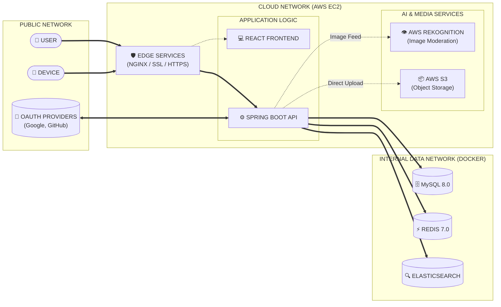

Janaka is a mid-performance, full-stack image hosting platform inspired by Pinterest. Built with a focus on scalability, AI-driven content moderation, and seamless user experience, it leverages a modern distributed architecture to handle large-scale media sharing.

---

## 🏗️ Architecture Overview

The system follows a monolithic backend approach with a decoupled React frontend, orchestrated via Docker. It utilizes a multi-layered data strategy for persistence, caching, and global search.

### System Diagram



---

## 🚀 Key Features

### 🔹 Advanced Image Management
- **AWS S3 Integration**: Secure and scalable storage for large media files.
- **AI Moderation**: Automatic content safety checks using **AWS Rekognition** to ensure community standards.
- **Optimized Uploads**: Support for multipart uploads and configurable file size limits (3MB max).

### 🔹 High-Performance Discovery
- **Fuzzy Search**: Global search powered by **Elasticsearch** for lightning-fast results and auto-suggestions.
- **Intelligent Feed**: Personalized user feeds implemented with an optimized fan-out strategy (Push/Pull mechanisms).
- **Infinite Scroll**: Seamless browsing experience on the frontend with paginated API responses.

### 🔹 Social & Engagement
- **Follow System**: Build your network by following other creators.
- **User Profiles**: Fully customizable profiles with pin collections.
- **OAuth2 Security**: Secure login via Google and GitHub.

---

## 🛠️ Technology Stack

| Layer | Technologies |
| :--- | :--- |
| **Frontend** | React 19, Vite 8, TypeScript, Styled Components (Glassmorphism) |
| **Backend** | Spring Boot 3.5.11, Java 21, Spring Security (OAuth2) |
| **Database** | MySQL 8.0 (Core Records), Redis 7.0 (Cache/Session) |
| **Search Engine** | Elasticsearch 7.17.10 |
| **Cloud/AI** | AWS S3 (Storage), AWS Rekognition (AI Moderation) |
| **Infrastructure** | Docker, Nginx/Caddy, Let's Encrypt (SSL) |

---

## 📂 Project Structure

```text
M-Interest/
├── ImageHosting/          # Spring Boot Backend API
│   ├── src/main/java/     # Core Business Logic
│   └── pom.xml            # Maven Configuration
├── Janaka/
│   └── janaka/            # React Frontend Application
│       ├── src/           # Components & Pages
│       └── vite.config.ts # Vite Configuration
├── docker-compose.yml     # Infrastructure Orchestration
└── .env                   # Environment Secrets
```

---

## ⚙️ Getting Started

### Prerequisites
- Docker & Docker Compose
- AWS Account (for S3 & Rekognition)
- OAuth2 Client IDs (for Google & GitHub)

### Quick Start
1. **Clone the repository**:
   ```bash
   git clone https://github.com/yourusername/m-interest.git
   cd m-interest
   ```

2. **Configure Environment Variables**:
   Create a `.env` file in the root directory and populate it based on `.env.example`:
   ```env
   MYSQL_ROOT_PASSWORD=your_password
   AWS_ACCESS_KEY=your_key
   AWS_SECRET_KEY=your_secret
   GOOGLE_CLIENT_ID=your_id
   GOOGLE_CLIENT_SECRET=your_secret
   # ... other keys
   ```

3. **Spin up the infrastructure**:
   ```bash
   docker-compose up -d
   ```

4. **Access the Application**:
   - Frontend: `http://localhost` (or configured SSL domain)
   - Backend API: `http://localhost:8080`

---

## 🛡️ Security & Performance
- **Session Management**: Handled via Redis to allow stateless horizontal scaling.
- **Validation**: Strict backend validation for upload limits (3 pins/day per user).

---

*Project by Mohit – Scalable Pinterest Clone Architecture*
